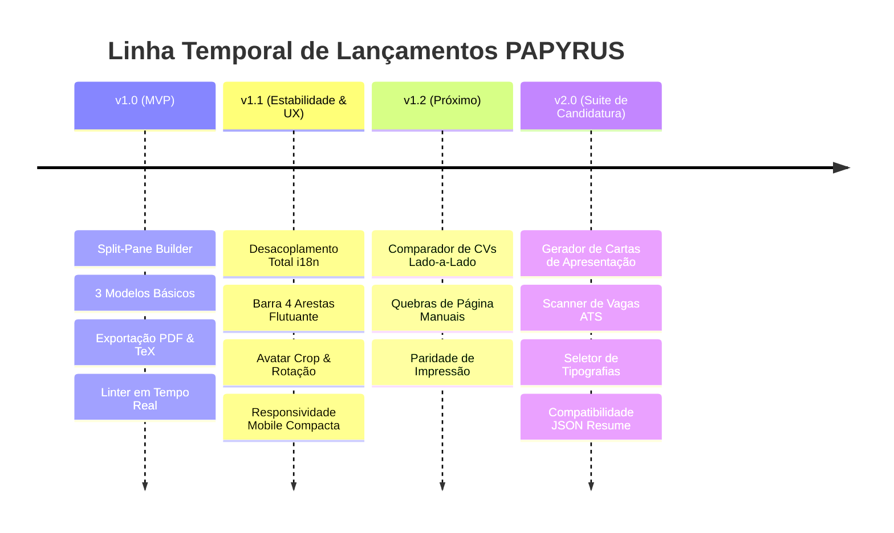

# 📋 PAPYRUS — Project Board & Roadmap

> **Central de Acompanhamento de Produto, Engenharia e Roadmap**  
> *Última atualização:* 2026-09-08 • *Status:* Ativo • *Versão Estável:* v1.1.2

---

## 🧭 Visão Geral do Produto

O **PAPYRUS** é um construtor e gestor dinâmico de currículos e CVs offline-first, desenhado com **Next.js 15**, **React 19**, **TypeScript** e **Tailwind CSS**. Focado em estética editorial limpa, conformidade rigorosa com sistemas ATS, suporte nativo multilingue e integração com automação de agentes de IA.

```
                              ┌───────────────────────────┐
                              │     PAPYRUS ENGINE        │
                              └─────────────┬─────────────┘
                                            │
           ┌───────────────────────┬────────┴────────┬───────────────────────┐
           ▼                       ▼                 ▼                       ▼
    [ Split-Pane UX ]     [ Multilingual i18n ] [ TeX & PDF Core ]    [ Agent Skill CLI ]
    - Live A4 Canvas      - Dual CV/UI Lang     - Exact 794x1123px    - Linter Audits
    - Draggable Toolbar   - Dynamic Add Lang    - Smart Break Rules   - TeX/JSON Conversions
    - Section Focusing    - 100% Localized      - Interactive Links   - Resume Tailoring
```

---

## 📊 Métricas & Indicadores do Projeto

| Métrica | Valor Atual | Meta / Benchmark | Status |
| :--- | :--- | :--- | :--- |
| **Suíte de Testes E2E** | 5/5 Suítes Aprovadas (100%) | 100% aprovação contínua | 🟢 Excelente |
| **Suíte de Testes de Campos** | 2 Perfis Stress-tested (100%) | Zero regressões em mutações | 🟢 Excelente |
| **Chaves de Tradução em Falta** | 0 chaves (100% cobertas) | 0 chaves em falta | 🟢 Perfeito |
| **Pontuação ATS Base** | 100% nos modelos Lateralis & Classic | >= 95% em todos os modelos | 🟢 Excelente |
| **Tempo de Build Estático** | ~2.8s no Next.js 15 | < 5.0s | 🟢 Rápido |
| **Pipeline CI/CD** | GitHub Actions + Vercel + GitGuardian | Automated PR & Production Gate | 🟢 Operacional |

---

## 📌 Quadro Kanban (Feature Tracking)

### 🚀 Shipped / Concluído

- [x] **[FEAT-001]** **Suporte Multilingue com Desacoplamento Completo (i18n)** `tags: i18n, core`
  - Separação estrita entre o idioma da interface da aplicação (`uiLang`) e o idioma do documento de CV (`cvLang`).
  - Seletor de nacionalidade com ícone de globo, pesquisa em tempo real, bandeiras e estados de bloqueio para línguas futuras.
  - Catálogos de tradução 100% completos em Inglês e Português (`common`, `builder`, `preview`, `a11y`).
- [x] **[FEAT-002]** **Barra de Ações Flutuante com Arrastamento pelas 4 Arestas** `tags: ui/ux, mobile`
  - Barra de ações reposicionável com drag-and-drop inteligente e encaixe magnético nas arestas superior, inferior, esquerda e direita.
  - Otimização dedicada para mobile e desktop sem colisão de controlos de zoom.
- [x] **[FEAT-003]** **Modal de Avatar com Crop, Rotação e Drag & Drop** `tags: ui/ux, media`
  - Upload intuitivo diretamente sobre o avatar com feedback visual no hover e suporte a drag & drop de imagens.
  - Controlo de corte circular, rotação a 90° e zoom digital antes de salvar.
- [x] **[FEAT-004]** **Command Palette Inteligente (`Cmd/Ctrl + K`)** `tags: ui/ux, accessibility`
  - Pesquisa rápida por categorias (*Templates & Style*, *CV Sections*, *Actions & Export*, *Preferences*).
  - Navegação fluida por teclado e atalhos globais.
- [x] **[FEAT-005]** **Otimização Extrema de Top Bar em Ecrãs Móveis** `tags: mobile, responsive`
  - Resolução de overflow em ecrãs $\le 390\text{px}$ (redução de largura de $435\text{px}$ para $272\text{px}$).
  - Botões compactos responsivos para Guia e Modelos sem corte de ecrã.
- [x] **[FEAT-006]** **Seleção Interativa no Preview e Scroll Focus** `tags: preview, editor`
  - Clique direto em qualquer bloco no preview A4 para abrir e focar automaticamente a secção e campo correspondente no formulário esquerdo.
- [x] **[FEAT-007]** **Motor de Exportação TeX (`.tex`) Bi-direcional** `tags: latex, export`
  - Exportação e importação de ficheiros `.tex` compiláveis com TeX Live, MacTeX e Overleaf com sanitização de caracteres especiais TeX.
- [x] **[FEAT-008]** **Motor de PDF A4 com Hyperlinks Interativos e Quebras Limpas** `tags: pdf, export`
  - Bloqueio rigoroso A4 ($794\text{px} \times 1123\text{px}$ a 96 DPI).
  - Deteção inteligente de limites de página (`data-page-break-avoid`) evitando cortes ao meio de linhas.
  - Mapeamento vetorial de links clicáveis para emails, telemóveis e URLs.
- [x] **[FEAT-009]** **Linter de Qualidade e Auditoria ATS em Tempo Real (0–100%)** `tags: quality, ats`
  - Avaliação contínua de verbos de impacto, contactos essenciais, consistência temporal e paridade de idiomas.
- [x] **[FEAT-010]** **Skill de Automação para Agentes IA (`cv-agent`) & CLI** `tags: ai, automation`
  - Scripts CLI (`npm run cv -- <command>`) e biblioteca TypeScript programática para mutação, tradução e auditoria sem browser.
- [x] **[FEAT-011]** **CI/CD Automático & Semantic PR Flow** `tags: devops, qa`
  - GitHub Actions com linting rígido, testes de tipos e validações E2E.
  - Pré-visualizações temporárias na Vercel para cada PR antes de merge para `main`.

---

### 🔄 In Progress / Sprint Atual (v1.2)

- [ ] **[FEAT-012]** **Comparador Visual e Diff Semântico de CVs (CV Comparator)** `tags: diff, review, ats`
  - *Status:* Especificação técnica completa concluída ([`docs/CV_COMPARATOR_SPEC.md`](docs/CV_COMPARATOR_SPEC.md)).
  - *Objetivo:* Comparação lado a lado sincronizada entre 2 CVs (CV base vs CV direcionado a vaga).
  - *Entregáveis:*
    1. Modo Visual Lado-a-Lado com scroll sincronizado.
    2. Diff textual intra-linha em marcadores e competências.
    3. Tabela comparativa de pontuação ATS e contagem de palavras.
- [ ] **[FEAT-013]** **Indicador Visual e Inserção Manual de Quebra de Página (`\pagebreak`)** `tags: pdf, editor`
  - *Status:* Prototipagem da régua A4.
  - *Objetivo:* Permitir ao utilizador arrastar ou inserir manualmente uma divisória de página quando o conteúdo ultrapassa uma página A4.
- [ ] **[FEAT-014]** **Pré-visualização Fiel em Modo de Impressão (CSS Print Emulation)** `tags: preview, styles`
  - *Status:* Mapeamento de estilos `@media print`.
  - *Objetivo:* Garantir paridade visual idêntica entre o que se vê no ecrã, a impressão nativa do navegador (`Ctrl+P`) e o PDF descarregado.

---

### 📋 Backlog Prioritário (v1.3 - v2.0)

- [ ] **[FEAT-015]** **Gerador de Carta de Apresentação (Cover Letter Engine)** `tags: feature, new-doc`
  - Criação de uma carta de apresentação coordenada esteticamente com o cabeçalho, cores e tipografia do modelo de CV escolhido.
  - Exportação em conjunto para PDF de página única ou pacote de candidatura unificado.
- [ ] **[FEAT-016]** **Assistente de Redação de Marcadores com Verbos de Ação e Métricas** `tags: ai, linter`
  - Sugestões contextuais inteligentes para transformar descrições passivas em realizações quantificadas (modelo Google XYZ: *"Realizei [X], medido por [Y], através de [Z]"*).
- [ ] **[FEAT-017]** **Scanner de Vagas ATS (Job Vacancy Keyword Matcher)** `tags: ats, recruiter`
  - Caixa para colar a descrição de uma vaga de emprego; o sistema analisa a interseção de palavras-chave, termos técnicos e destaca termos em falta no CV.
- [ ] **[FEAT-018]** **Seletor de Famílias Tipográficas Editoriais** `tags: styling, typography`
  - Adição de famílias tipográficas curadas para ATS e design:
    - *Serif:* Merriweather, EB Garamond, Source Serif.
    - *Sans-Serif:* Inter, Roboto, Outfit, Plus Jakarta Sans.
    - *Mono:* JetBrains Mono, Fira Code.
- [ ] **[FEAT-019]** **Compatibilidade com Padrão JSON Resume & Europass XML** `tags: interoperability, standards`
  - Importação e exportação de esquemas padronizados da comunidade internacional (`jsonresume.org`) e Europass XML.
- [ ] **[FEAT-020]** **Widget Gerador de QR Code no Cabeçalho** `tags: contact, modern`
  - Opção para embutir no cabeçalho do CV um QR Code vetorial personalizável apontando para o perfil LinkedIn, GitHub ou portfólio web.
- [ ] **[FEAT-021]** **Criptografia e Acessibilidade em PDF (PDF/UA standard)** `tags: pdf, security`
  - Suporte opcional a palavra-passe de proteção de leitura e anotações semânticas de leitor de ecrã para conformidade com normas governamentais de acessibilidade.

---

### 💡 Icebox / Brainstorming Futuro

- [ ] **[IDEA-001]** **Sincronização em Nuvem Privada (WebDAV, Nextcloud ou Google Drive)**
  - Manter o foco offline-first com sincronização opcional e encriptada ponta-a-ponta na cloud privada do utilizador.
- [ ] **[IDEA-002]** **Exportação em Formato Vetorial SVG**
  - Permitir a designers editar os blocos do CV no Figma ou Adobe Illustrator.
- [ ] **[IDEA-003]** **Tema Escuro em Exportação de PDF para Portfólios Criativos**
  - Opção para exportar PDFs com fundo escuro elegante para perfis de artes digitais e multimédia.
- [ ] **[IDEA-004]** **Gestão Multi-Perfil (Dev, Consultor, Docente)**
  - Guardar múltiplos perfis e permutar instantaneamente os dados base conforme o destino da candidatura.

---

## 🗺️ Roadmap de Versões



---

## 🛠️ Regras de Engenharia & Workflow de Contribuição

1. **GitHub Flow Semântico**: Criar sempre uma branch com prefixo semântico (`feat/`, `fix/`, `refactor/`, `test/`, `docs/`).
2. **Pull Requests com CI Obrigatório**: Nenhum commit direto na `main`. Os PRs só recebem merge após:
   - `npm run lint` com zero erros.
   - `npm run build` com build estático limpo.
   - `npm run test:e2e` e `npm run test:fields` aprovados.
3. **Atomic Commits**: Seguir o padrão Conventional Commits (`feat(scope): ...`, `fix(scope): ...`).
4. **Respeito às Diretrizes de Design**: Consultar sempre [`DESIGN.md`](DESIGN.md) e [`docs/CHARM_DESIGN_GUIDELINES.md`](docs/CHARM_DESIGN_GUIDELINES.md) antes de alterar qualquer componente visual.
