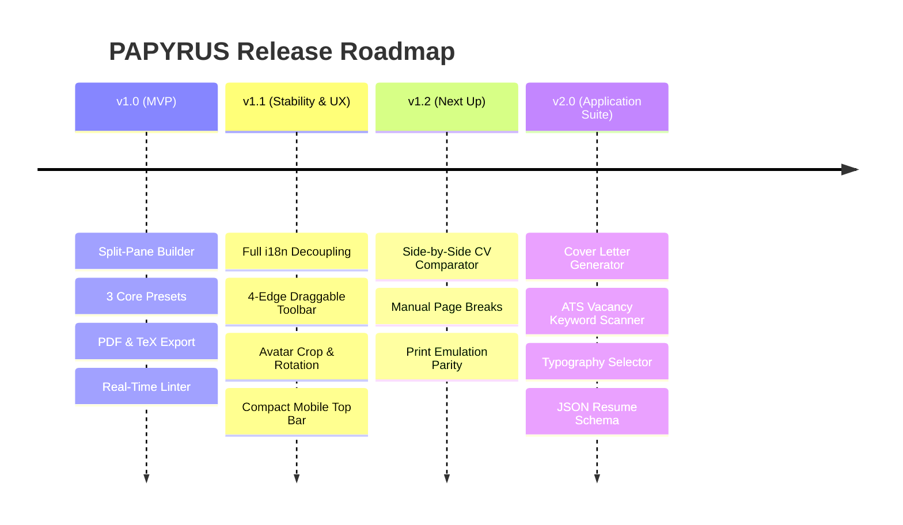

# 📋 PAPYRUS — Project Board & Strategic Roadmap

> **Product, Engineering & Roadmap Tracking Center**  
> *Last Updated:* 2026-09-08 • *Status:* Active • *Stable Version:* v1.1.2

---

## 🧭 Product Vision & Architecture

**PAPYRUS** is an offline-first, multilingual dynamic resume and CV builder engine built with **Next.js 15**, **React 19**, **TypeScript**, and **Tailwind CSS**. Built with clean editorial aesthetics, strict ATS parser compliance, native multilingual support, and seamless integration with AI agent automation.

```
                              ┌───────────────────────────┐
                              │     PAPYRUS ENGINE        │
                              └─────────────┬─────────────┘
                                            │
           ┌───────────────────────┬────────┴────────┬───────────────────────┐
           ▼                       ▼                 ▼                       ▼
    [ Split-Pane UX ]     [ Multilingual i18n ] [ TeX & PDF Core ]    [ Agent Skill CLI ]
    - Live A4 Canvas      - Decoupled UI/CV     - Exact 794x1123px    - Linter Audits
    - Draggable Toolbar   - Dynamic Add Lang    - Smart Break Rules   - TeX/JSON Conversions
    - Section Focusing    - 100% Localized      - Interactive Links   - Resume Tailoring
```

---

## 📊 Project Health & Key Metrics

| Metric | Current Value | Target / Benchmark | Status |
| :--- | :--- | :--- | :--- |
| **E2E Verification Suite** | 5/5 Test Suites Passing (100%) | 100% Continuous Pass | 🟢 Excellent |
| **Field Editing Suite** | 2 Seed Profiles Stress-tested (100%) | Zero Mutation Regressions | 🟢 Excellent |
| **Missing Translation Keys** | 0 missing keys (100% covered) | 0 missing keys | 🟢 Perfect |
| **Base ATS Score** | 100% on Lateralis & Classic presets | >= 95% across all templates | 🟢 Excellent |
| **Static Build Time** | ~2.8s on Next.js 15 | < 5.0s | 🟢 Fast |
| **CI/CD Pipeline** | GitHub Actions + Vercel + GitGuardian | Automated PR & Production Gate | 🟢 Operational |

---

## 📌 Kanban Board (Feature Tracking)

### 🚀 Shipped / Completed

- [x] **[FEAT-001]** **Full Multilingual Support with Complete Decoupling (i18n)** `tags: i18n, core`
  - Strict separation between application interface language (`uiLang`) and CV document language (`cvLang`).
  - Nationality / UI switcher with globe icon, real-time search, national flags, and locked states for upcoming languages.
  - Symmetrical, 100% complete translation catalogs in English and Portuguese (`common`, `builder`, `preview`, `a11y`).
- [x] **[FEAT-002]** **Floating Action Bar with 4-Edge Draggable Snapping** `tags: ui/ux, mobile`
  - Floating action toolbar with intelligent drag-and-drop and magnetic docking on top, bottom, left, and right edges.
  - Dedicated mobile and desktop optimizations avoiding duplicate zoom controls.
- [x] **[FEAT-003]** **Avatar Modal with Circular Crop, 90° Rotation & Drag-and-Drop** `tags: ui/ux, media`
  - Intuitive upload directly onto avatar with hover feedback and full drag-and-drop image support.
  - Interactive circular crop canvas, 90-degree step rotation, and digital zoom before saving.
- [x] **[FEAT-004]** **Smart Command Palette (`Cmd/Ctrl + K`)** `tags: ui/ux, accessibility`
  - Fast search grouped into categories (*Templates & Style*, *CV Sections*, *Actions & Export*, *Preferences*).
  - Smooth keyboard navigation and global keyboard shortcuts.
- [x] **[FEAT-005]** **Mobile Top Bar Extreme Optimization** `tags: mobile, responsive`
  - Resolved horizontal overflow on viewports $\le 390\text{px}$ (width footprint reduced from $435\text{px}$ to $272\text{px}$).
  - Responsive compact touch targets for Guide and Presets buttons without edge clipping.
- [x] **[FEAT-006]** **Interactive Preview Targeting & Smooth Scroll Focus** `tags: preview, editor`
  - Clicking any section block in the live A4 preview automatically focuses and scrolls to the corresponding form field in the left pane.
- [x] **[FEAT-007]** **Bi-directional TeX (`.tex`) Export & Import Engine** `tags: latex, export`
  - Export and import compilable `.tex` documents compatible with TeX Live, MacTeX, and Overleaf with LaTeX character escaping.
- [x] **[FEAT-008]** **Precision A4 PDF Engine with Clickable Hyperlinks & Clean Page Breaks** `tags: pdf, export`
  - Strictly locked A4 dimensions ($794\text{px} \times 1123\text{px}$ at 96 DPI).
  - Intelligent page-break algorithm (`data-page-break-avoid`) preventing spliced text lines.
  - Vector mapping of clickable hyperlinks for email addresses, phone numbers, and web URLs.
- [x] **[FEAT-009]** **Real-Time ATS Quality Audit & Linter (0–100%)** `tags: quality, ats`
  - Continuous evaluation of action verbs, essential contact information, date consistency, and multilingual parity.
- [x] **[FEAT-010]** **AI Agent Automation Skill (`cv-agent`) & CLI Suite** `tags: ai, automation`
  - CLI scripts (`npm run cv -- <command>`) and programmatic TypeScript API for auditing, mutating, and exporting CVs without a browser.
- [x] **[FEAT-011]** **Automated CI/CD Quality Gates & Semantic PR Flow** `tags: devops, qa`
  - GitHub Actions with strict linting, TypeScript type-checking, and end-to-end test validations.
  - Temporary Vercel preview builds for every pull request before merging into `main`.

---

### 🔄 In Progress / Current Sprint (v1.2)

- [ ] **[FEAT-012]** **Visual CV Comparator & Semantic Diff Engine** `tags: diff, review, ats`
  - *Status:* Technical specification complete ([`docs/CV_COMPARATOR_SPEC.md`](docs/CV_COMPARATOR_SPEC.md)).
  - *Objective:* Side-by-side synchronized comparison between 2 CV versions (e.g. baseline generic CV vs job-tailored CV).
  - *Deliverables:*
    1. Side-by-side visual canvas mode with synchronized scrolling.
    2. Word-level inline diff in bullet points and skills.
    3. Comparative ATS keyword and word-count score matrix.
- [ ] **[FEAT-013]** **Visual Page Break Guide & Manual Page Split (`\pagebreak`)** `tags: pdf, editor`
  - *Status:* A4 ruler prototyping.
  - *Objective:* Allow users to drag or manually insert page break separators when document content exceeds one page.
- [ ] **[FEAT-014]** **High-Fidelity Print Mode Preview (CSS Print Emulation)** `tags: preview, styles`
  - *Status:* Mapping `@media print` rules.
  - *Objective:* Guarantee visual parity between on-screen live preview, browser native print dialog (`Ctrl+P`), and exported PDF.

---

### 📋 Priority Backlog (v1.3 - v2.0)

- [ ] **[FEAT-015]** **Cover Letter Generator Engine** `tags: feature, new-doc`
  - Coordinated cover letter generation matching the header, accent color, and typography of the active CV template.
  - Batch export into a unified multi-page PDF application package.
- [ ] **[FEAT-016]** **AI-Assisted Bullet Point Polisher (Google XYZ Formula)** `tags: ai, linter`
  - Intelligent suggestions converting passive descriptions into quantified accomplishments (*"Accomplished [X], measured by [Y], by doing [Z]"*).
- [ ] **[FEAT-017]** **ATS Job Vacancy Keyword Matcher** `tags: ats, recruiter`
  - Text area to paste job descriptions; analyzes keyword intersection and highlights missing high-value technical terms.
- [ ] **[FEAT-018]** **Editorial Typography Selector** `tags: styling, typography`
  - Curated font families optimized for ATS readability and aesthetics:
    - *Serif:* Merriweather, EB Garamond, Source Serif.
    - *Sans-Serif:* Inter, Roboto, Outfit, Plus Jakarta Sans.
    - *Mono:* JetBrains Mono, Fira Code.
- [ ] **[FEAT-019]** **JSON Resume & Europass XML Schema Interoperability** `tags: interoperability, standards`
  - Import and export support for standard `jsonresume.org` open schemas and Europass XML format.
- [ ] **[FEAT-020]** **Header Vector QR Code Generator** `tags: contact, modern`
  - Optional customizable vector QR code embedded in the CV header linking to LinkedIn, GitHub, or online portfolio.
- [ ] **[FEAT-021]** **PDF Encryption & PDF/UA Accessibility Compliance** `tags: pdf, security`
  - Optional read-protection password encryption and screen-reader semantic tagging for government accessibility standards.

---

### 💡 Icebox / Future Exploration

- [ ] **[IDEA-001]** **Private Cloud Sync (WebDAV, Nextcloud, or Google Drive)**
  - Optional end-to-end encrypted backup to the user's private cloud storage while preserving the offline-first architecture.
- [ ] **[IDEA-002]** **Vector SVG Export Engine**
  - Export resume layers as vector SVG for fine-tuning in Figma or Adobe Illustrator.
- [ ] **[IDEA-003]** **Dark Mode PDF Export for Creative Portfolios**
  - High-contrast dark background PDF option tailored for digital media and game design portfolios.
- [ ] **[IDEA-004]** **Multi-Profile CV Management**
  - Store and toggle between multiple profiles (e.g., Software Engineer profile vs Engineering Manager profile).

---

## 🗺️ Version Release Timeline



---

## 🛠️ Engineering Rules & Contribution Workflow

1. **Semantic GitHub Flow**: Always create branches with semantic prefixes (`feat/`, `fix/`, `refactor/`, `test/`, `docs/`).
2. **Mandatory CI Checks on Pull Requests**: Never commit directly to `main`. PRs merge only when:
   - `npm run lint` passes with 0 errors.
   - `npm run build` static production build compiles cleanly.
   - `npm run test:e2e` and `npm run test:fields` pass with 100% success.
3. **Atomic Conventional Commits**: Follow Conventional Commits format (`feat(scope): ...`, `fix(scope): ...`, `docs: ...`).
4. **Design Integrity**: Always review [`DESIGN.md`](DESIGN.md) and [`docs/CHARM_DESIGN_GUIDELINES.md`](docs/CHARM_DESIGN_GUIDELINES.md) prior to modifying visual components.
